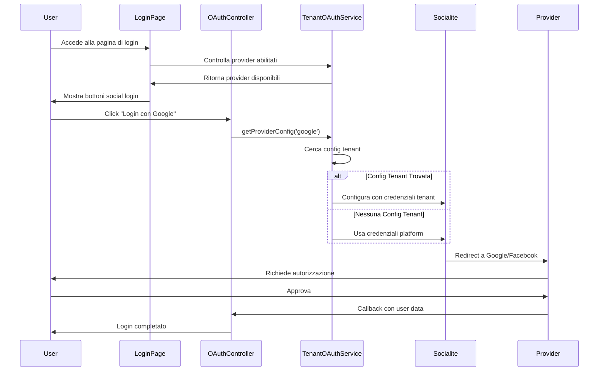

# 🏗️ Architettura OAuth Multi-Tenant - AINSTEIN

**Versione**: 1.1
**Data**: 2025-10-10
**Status**: ✅ Implementato e Aggiornato con separazione Social/API

---

## 📋 Overview

AINSTEIN implementa un sistema OAuth multi-tenant completo che supporta:
- **Social Login**: Autenticazione utenti tramite Google e Facebook
- **Multi-Tenancy**: Ogni tenant può configurare le proprie credenziali OAuth
- **Fallback Globale**: Credenziali platform-wide come backup
- **Encryption**: Tutte le credenziali sono criptate nel database

## 🎯 Architettura del Sistema

### 1. Livelli di Configurazione

```
┌────────────────────────────────────────────────────────┐
│         LIVELLO PLATFORM (Fallback) - Admin Panel       │
├────────────────────────────────────────────────────────┤
│ Tabella: platform_settings                             │
│                                                        │
│ SOCIAL LOGIN (Tab 1):                                 │
│ - google_social_client_id                             │
│ - google_social_client_secret                         │
│ - facebook_social_app_id                              │
│ - facebook_social_app_secret                          │
│                                                        │
│ API INTEGRATIONS (Tab 2):                             │
│ - google_ads_client_id                                │
│ - google_ads_client_secret                            │
│ - google_console_client_id                            │
│ - google_console_client_secret                        │
│ - facebook_ads_app_id                                 │
│ - facebook_ads_app_secret                             │
└────────────────────────────────────────────────────────┘
                    ↓
┌────────────────────────────────────────────────────────┐
│         LIVELLO TENANT (Priorità) - Tenant Dashboard    │
├────────────────────────────────────────────────────────┤
│ Tabella: tenant_oauth_providers                        │
│ - tenant_id                                            │
│ - provider (google/facebook)                           │
│ - client_id (encrypted)                                │
│ - client_secret (encrypted)                            │
│ - enabled                                              │
└────────────────────────────────────────────────────────┘
```

### 2. Flow di Autenticazione



## 🔧 Componenti Principali

### 1. Database Schema

#### Tabella: `platform_settings` (Aggiornata)
```sql
-- Nuovi campi aggiunti per separare Social Login da API Integrations
ALTER TABLE platform_settings ADD COLUMN google_social_client_id TEXT;
ALTER TABLE platform_settings ADD COLUMN google_social_client_secret TEXT;
ALTER TABLE platform_settings ADD COLUMN facebook_social_app_id TEXT;
ALTER TABLE platform_settings ADD COLUMN facebook_social_app_secret TEXT;

-- Campi esistenti rinominati per chiarezza (API Integrations)
-- google_client_id → google_ads_client_id
-- google_client_secret → google_ads_client_secret
-- facebook_app_id → facebook_ads_app_id
-- facebook_app_secret → facebook_ads_app_secret
```

#### Tabella: `tenant_oauth_providers`
```sql
CREATE TABLE tenant_oauth_providers (
    id BIGINT PRIMARY KEY,
    tenant_id BIGINT NOT NULL,
    provider VARCHAR(50) NOT NULL,
    client_id TEXT,              -- Encrypted
    client_secret TEXT,           -- Encrypted
    enabled BOOLEAN DEFAULT false,
    test_status VARCHAR(50),
    test_message TEXT,
    tested_at TIMESTAMP,
    created_at TIMESTAMP,
    updated_at TIMESTAMP,

    UNIQUE KEY unique_tenant_provider (tenant_id, provider),
    FOREIGN KEY (tenant_id) REFERENCES tenants(id) ON DELETE CASCADE
);
```

### 2. Models

#### `TenantOAuthProvider`
```php
class TenantOAuthProvider extends Model
{
    protected $fillable = [
        'tenant_id',
        'provider',
        'client_id',
        'client_secret',
        'enabled',
        'test_status',
        'test_message',
        'tested_at',
    ];

    protected $casts = [
        'enabled' => 'boolean',
        'tested_at' => 'datetime',
        'client_id' => 'encrypted',      // Encryption automatica
        'client_secret' => 'encrypted',   // Encryption automatica
    ];

    // Helper methods
    public function isConfigured(): bool
    public function isEnabled(): bool
    public function markAsTested(string $status, ?string $message = null): void
}
```

### 3. Service Layer

#### `TenantOAuthService`
```php
class TenantOAuthService
{
    /**
     * Ottiene la configurazione OAuth per un provider
     * Prima cerca config tenant, poi fallback su platform
     */
    public function getProviderConfig(string $provider, ?int $tenantId = null): ?array
    {
        // 1. Cerca configurazione tenant
        if ($tenantId) {
            $tenantConfig = TenantOAuthProvider::where('tenant_id', $tenantId)
                ->where('provider', $provider)
                ->where('enabled', true)
                ->first();

            if ($tenantConfig && $tenantConfig->isConfigured()) {
                return [
                    'client_id' => $tenantConfig->client_id,
                    'client_secret' => $tenantConfig->client_secret,
                ];
            }
        }

        // 2. Fallback su configurazione platform
        return $this->getPlatformConfig($provider);
    }

    /**
     * Configura Socialite dinamicamente con le credenziali corrette
     */
    public function configureSocialite(string $provider, ?int $tenantId = null): void
    {
        $config = $this->getProviderConfig($provider, $tenantId);

        if ($config) {
            config([
                "services.{$provider}.client_id" => $config['client_id'],
                "services.{$provider}.client_secret" => $config['client_secret'],
            ]);
        }
    }
}
```

### 4. Controllers

#### `OAuthSettingsController`
```php
class OAuthSettingsController extends Controller
{
    // Gestione settings OAuth per tenant
    public function index()
    public function update(Request $request, string $provider)
    public function test(string $provider)
    public function enable(string $provider)
    public function disable(string $provider)
}
```

#### `SocialAuthController`
```php
class SocialAuthController extends Controller
{
    public function redirectToProvider(string $provider, TenantOAuthService $service)
    {
        // Configura Socialite con credenziali corrette
        $service->configureSocialite($provider, auth()->user()->tenant_id);

        return Socialite::driver($provider)->redirect();
    }

    public function handleProviderCallback(string $provider, TenantOAuthService $service)
    {
        $service->configureSocialite($provider, session('tenant_id'));

        $socialUser = Socialite::driver($provider)->user();
        // ... gestione login/registrazione
    }
}
```

## 🔒 Sicurezza

### 1. Encryption
- **At Rest**: Client ID e Secret criptati nel database usando Laravel Crypt
- **In Transit**: Tutte le comunicazioni OAuth su HTTPS
- **Key Management**: APP_KEY di Laravel gestisce la crittografia

### 2. Validation
- **State Parameter**: Socialite gestisce automaticamente CSRF protection
- **Scope Limitation**: Solo email e profilo base richiesti
- **Domain Validation**: Callback URLs verificati dai provider

### 3. Access Control
- **Policy**: Solo tenant admin può modificare settings OAuth
- **Isolation**: Ogni tenant vede solo le proprie configurazioni
- **Audit**: Log di tutte le modifiche alle configurazioni

## 📊 Priorità e Fallback

### Ordine di Risoluzione Configurazioni

1. **Tenant Config** (massima priorità)
   - Se tenant ha configurato e abilitato il provider
   - Usa credenziali specifiche del tenant

2. **Platform Config** (fallback)
   - Se tenant non ha configurazione
   - Usa credenziali globali della piattaforma

3. **Environment Variables** (ultimo fallback)
   - Se nessuna configurazione database
   - Usa variabili .env

```php
// Esempio di risoluzione
$config =
    $tenantConfig ??           // Prima: config tenant
    $platformConfig ??          // Poi: config platform
    config('services.google');  // Infine: config Laravel
```

## 🎨 UI Components

### Login Page Integration
```blade
@php
    $oauthProviders = app(TenantOAuthService::class)->getEnabledProviders();
@endphp

@if(count($oauthProviders) > 0)
    <div class="oauth-login-section">
        @foreach($oauthProviders as $provider)
            <a href="{{ route('social.redirect', $provider) }}"
               class="btn-oauth btn-{{ $provider }}">
                <i class="fab fa-{{ $provider }}"></i>
                Continua con {{ ucfirst($provider) }}
            </a>
        @endforeach
    </div>
@endif
```

### Settings Dashboard
```blade
<!-- tenant/settings/oauth.blade.php -->
<div class="oauth-settings">
    @foreach(['google', 'facebook'] as $provider)
        <div class="provider-config">
            <h3>{{ ucfirst($provider) }} OAuth</h3>

            <form method="POST" action="{{ route('tenant.oauth.update', $provider) }}">
                @csrf
                @method('PUT')

                <input type="text" name="client_id"
                       placeholder="Client ID"
                       value="{{ $settings[$provider]['client_id'] ?? '' }}">

                <input type="password" name="client_secret"
                       placeholder="Client Secret"
                       value="{{ $settings[$provider]['client_secret'] ?? '' }}">

                <button type="submit">Salva</button>
            </form>

            <button onclick="testOAuth('{{ $provider }}')">Test</button>

            <input type="checkbox"
                   onchange="toggleProvider('{{ $provider }}')"
                   {{ $settings[$provider]['enabled'] ? 'checked' : '' }}>
            Abilita
        </div>
    @endforeach
</div>
```

## 📈 Monitoring e Analytics

### Metriche Tracciate
- Login riusciti per provider
- Login falliti con error codes
- Tenant che usano OAuth
- Provider più utilizzati

### Database Queries
```sql
-- Login di successo per provider
SELECT provider, COUNT(*) as login_count
FROM oauth_logins
WHERE status = 'success'
GROUP BY provider;

-- Tenant con OAuth configurato
SELECT t.name, COUNT(top.id) as configured_providers
FROM tenants t
LEFT JOIN tenant_oauth_providers top ON t.id = top.tenant_id
WHERE top.enabled = true
GROUP BY t.id;
```

## 🔄 Manutenzione

### Rotazione Credenziali
1. Genera nuove credenziali nel provider (Google/Facebook)
2. Aggiorna nel dashboard tenant o admin
3. Test della configurazione
4. Le vecchie credenziali vengono sovrascritte (criptate)

### Backup Considerazioni
- Le credenziali sono criptate con APP_KEY
- Cambiare APP_KEY rende le credenziali illeggibili
- Backup APP_KEY insieme al database

### Troubleshooting Comune

| Problema | Causa | Soluzione |
|----------|-------|-----------|
| "Invalid Client" | Credenziali errate | Verifica Client ID/Secret |
| "Redirect URI Mismatch" | Callback URL non corrisponde | Aggiungi URL esatto nel provider |
| "Decryption Error" | APP_KEY cambiata | Riconfigura tutte le credenziali |
| "Provider Not Available" | Non configurato/abilitato | Configura e abilita nel dashboard |

## 🚀 Future Enhancements

### Pianificati
- [ ] Supporto per più provider (LinkedIn, Twitter, etc.)
- [ ] OAuth per API integrations (non solo login)
- [ ] Tenant-specific callback URLs
- [ ] OAuth token refresh automatico per API

### In Considerazione
- [ ] SAML support per enterprise
- [ ] OpenID Connect compliance
- [ ] Multi-factor authentication via OAuth
- [ ] Social account linking/unlinking

## 📝 Note Implementative

### Distinzione OAuth Types
Il sistema distingue tra due tipologie di configurazioni OAuth completamente separate:

#### 1. **Social Login OAuth** (Autenticazione Utenti)
- **Scopo**: Login e registrazione utenti tramite provider social
- **Gestione Admin**: Platform Settings → Tab "Social Login"
- **Campi Database** in `platform_settings`:
  - `google_social_client_id`, `google_social_client_secret`
  - `facebook_social_app_id`, `facebook_social_app_secret`
- **Override Tenant**: Tramite tabella `tenant_oauth_providers`
- **Service**: `TenantOAuthService`
- **Routes**: `/auth/google/callback`, `/auth/facebook/callback`

#### 2. **API OAuth** (Integrazioni Servizi)
- **Scopo**: Accesso API per import dati, automazioni, analytics
- **Gestione Admin**: Platform Settings → Tab "API Integrations"
- **Campi Database** in `platform_settings`:
  - Google Ads: `google_ads_client_id`, `google_ads_client_secret`
  - Facebook Ads: `facebook_ads_app_id`, `facebook_ads_app_secret`
  - Search Console: `google_console_client_id`, `google_console_client_secret`
- **Service**: Specifico per ogni integrazione
- **Routes**: Specifiche per ogni servizio API

**Importante**: Queste due tipologie usano credenziali OAuth completamente separate anche se provengono dallo stesso provider (es. Google)

### Testing
```bash
# Test unitari
php artisan test --filter=OAuthTest

# Test integrazione
php artisan test --filter=OAuthIntegrationTest

# Test manuale
1. Configura provider nel dashboard
2. Click "Test" per verificare
3. Logout e prova login social
```

---

**Documentazione correlata**:
- [OAUTH_SETUP_GUIDE.md](../OAUTH_SETUP_GUIDE.md) - Guida configurazione
- [GOOGLE_OAUTH_SETUP.md](../GOOGLE_OAUTH_SETUP.md) - Setup Google specifico
- [API Documentation](../api/oauth.md) - API endpoints OAuth
